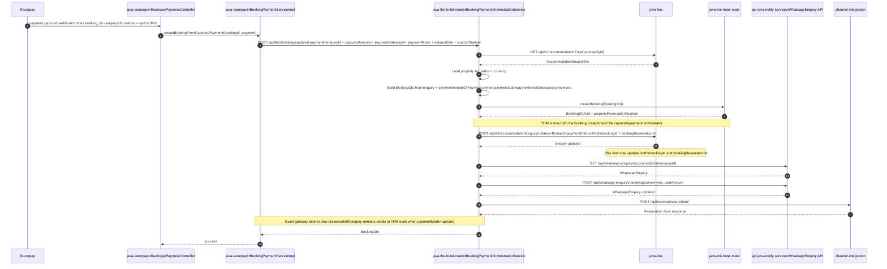
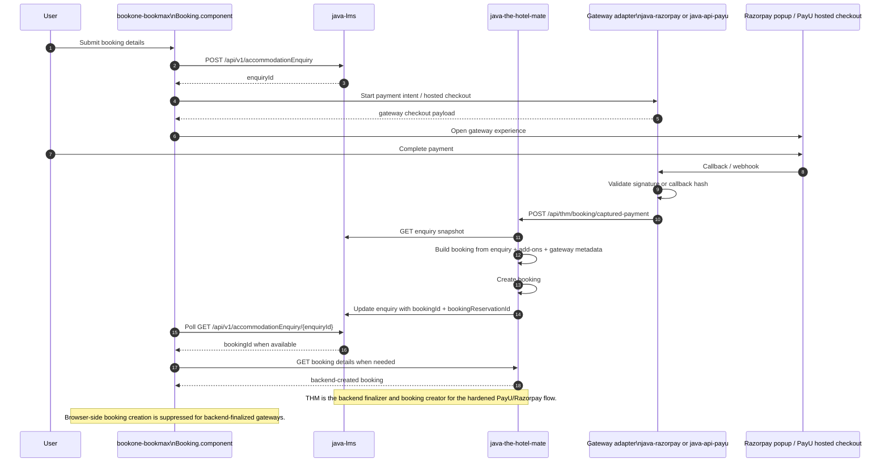
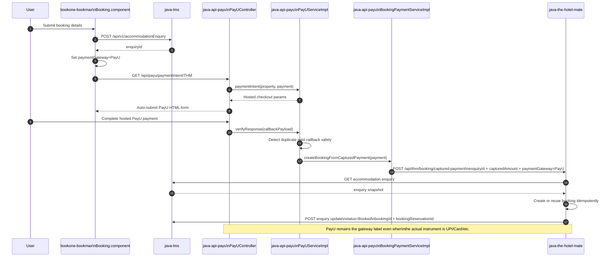
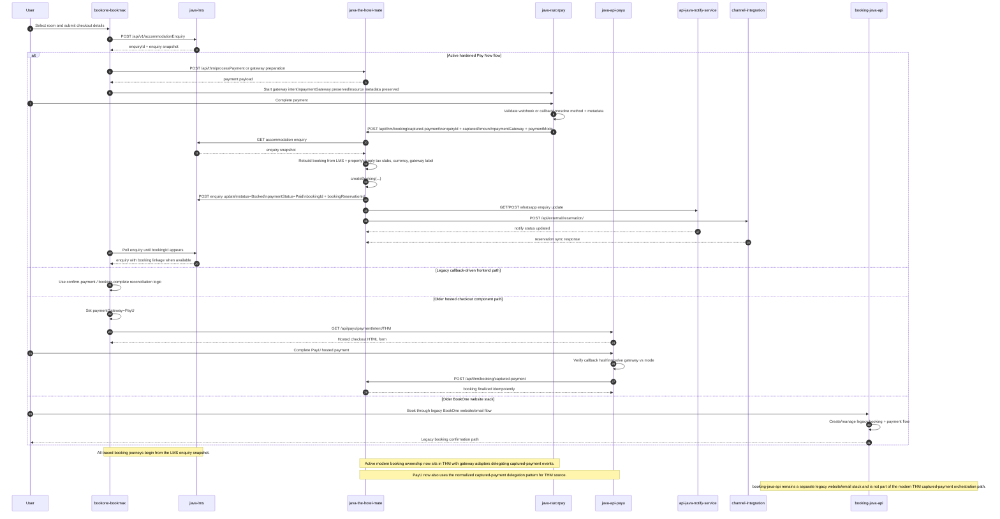

# Bookmax Checkout Flow

Last updated: 2026-04-10

## Purpose

This document captures the Bookmax checkout and booking orchestration flow across the frontend and backend services in this workspace. It is intended to be the maintained reference for:

- which component creates the LMS enquiry
- which service creates the THM booking
- which service updates LMS after payment
- which downstream services are called after booking creation
- which repositories are required to understand and maintain the flow

For field-level ownership and cross-project naming alignment, use `BOOKONE_CROSS_PROJECT_FIELD_MAPPING.md` alongside this flow document.

## Related Repositories

The full checkout flow spans these repositories:

- `bookone-bookmax` - Angular frontend and payment orchestration UI
- `java-lms` - enquiry storage and enquiry status lookup
- `java-the-hotel-mate` - booking creation and captured-payment orchestration
- `java-razorpay` - Razorpay order creation and webhook validation/delegation
- `java-api-payu` - PayU hosted-checkout callbacks, payment verification, and captured-payment delegation
- `api-java-notify-service` - WhatsApp enquiry tracking and message workflows
- `channel-integration` - external reservation push to downstream PMS/channel manager
- `booking-java-api` - email and separate website booking stack used by older/alternate flows

## Finalized Architecture

The current refactor direction is now established and partially enforced in code:

- LMS is the durable enquiry and booking-linkage store.
- THM is the booking-domain owner and the authoritative captured-payment finalizer.
- Razorpay and PayU terminate their own raw gateway callbacks and normalize successful captured-payment facts into THM.
- Bookmax no longer creates bookings or add-on services in the browser for backend-finalized gateways (`Razorpay`, `PayU`) in the hardened checkout paths.
- THM finalization is idempotent and reuses an existing LMS-linked booking when callbacks are replayed.
- LMS persists richer `serviceQuoteSummary` snapshot data so backend finalization can rebuild selected add-ons without relying on browser token storage.
- Bookmax voucher confirmation can now fall back to backend `booking.services` when enquiry add-on session data is absent.
- THM downstream guest-facing outputs now use enriched email/voucher models for coupon, promotion, advance, due, and service details.
- `channel-integration` remains limited to room-booking-compatible downstream reservation transport and should not ingest hotel add-on service lines.
- booked service ingestion for PMS-connected properties should happen through a separate post-confirmation API path aligned to the existing `bookone-core` service model.
- `paymentGateway` and `paymentMode` are intentionally separate:
    - `paymentGateway` = `Razorpay`, `PayU`
    - `paymentMode` = `UPI`, `Card`, `NetBanking`, etc.

What remains legacy:

- older frontend routes such as `booking-complete` and `confirm-payment`
- older generic payment component flows that still rely on callback-style redirects
- some browser-side booking code paths for non-hardened legacy gateways

## Service Ownership

### Frontend

Repository: `bookone-bookmax`

Primary responsibilities:

- create LMS accommodation enquiry
- request payment initiation
- send explicit payment gateway metadata from the checkout flow
- open payment window for Razorpay
- poll payment status for hosted or popup flows
- poll LMS for booking completion for backend-finalized gateways
- avoid browser-side booking and add-on creation for `Razorpay` and `PayU` in the hardened checkout flows

Important files:

- `src/app/views/landing/Booking/Booking.component.ts`
- `src/app/views/landing/booking-confirm/booking-confirm.component.ts`
- `src/app/views/landing/checkout-razorpay/checkout-razorpay.component.ts`
- `src/app/views/landing/confirm-payment/confirm-payment.component.ts`
- `src/app/views/landing/booking-complete/booking-complete.component.ts`
- `src/services/hotel-booking.service.ts`

### Enquiry Store

Repository: `java-lms`

Primary responsibility:

- store and return `AccommodationEnquiry`
- store selected-service and quoted pricing snapshot fields used for backend finalization
- persist `serviceQuoteSummary`, `couponCode`, `promotionName`, and booking-linkage fields required for backend recovery and post-payment UI hydration
- persist `bookingId` and `bookingReservationId` after THM booking creation

Important endpoint:

- `POST /api/v1/accommodationEnquiry`
- `GET /api/v1/accommodationEnquiry/{enquiryId}`

### Booking Creator

Repository: `java-the-hotel-mate`

Primary responsibility:

- create the actual booking record in THM
- orchestrate captured-payment booking conversion for the webhook booking flow
- reconstruct selected add-ons and quoted totals from LMS enquiry snapshot
- update LMS booking linkage idempotently
- enrich guest-facing downstream read models used by booking email and voucher generation
- own post-payment timeout handling and any future property-configured auto-refund orchestration for PMS-connected properties

Important endpoint:

- `POST /api/thm/booking`
- `POST /api/thm/booking/command`
- `POST /api/thm/booking/captured-payment`

Important note:

- `java-the-hotel-mate` is the actual booking creator
- the captured-payment conversion path now lives in THM instead of in gateway adapters
- THM short-circuits duplicate callback replays when LMS enquiry already has `bookingId`
- THM now carries richer coupon, promotion, advance, due, and service detail fields into `BookingEmailDto` and voucher templates
- future stranded-payment recovery and property-configured auto refund should also live in THM orchestration

### Downstream Reservation Push

Repository: `channel-integration`

Primary responsibility:

- receive normalized external reservation payloads for room-booking-compatible PMS/channel transport
- remain isolated from hotel add-on service ingestion semantics used by other systems

Important note:

- do not extend `channel-integration` to ingest hotel service lines for this booking flow
- room-booking fields such as booking identity, stay dates, guest counts, and supported booking-level offer fields can still be mapped where the downstream contract supports them
- hotel service ingestion should be a separate post-confirmation API flow, not part of the shared external reservation push

### Payment Orchestrator

Repository: `java-razorpay`

Primary responsibilities:

- create Razorpay order via `paymentIntentHotelmate`
- receive `payment.captured` webhook
- branch logic based on `notes.booking_id` versus `notes.enquiryId`
- delegate booking conversion to THM for the `notes.booking_id` path
- preserve source metadata in Razorpay order notes and forward exact gateway identity to THM
- validate webhook HMAC signature before captured-payment delegation

Important note:

- `notes.booking_id` path is now webhook validation plus THM delegation
- `notes.enquiryId` remains a status-update path in older flow handling, but the hardened Bookmax checkout now relies on backend finalization and LMS booking polling

### PayU Payment Converter

Repository: `java-api-payu`

Primary responsibilities:

- render hosted-checkout form via `/api/payu/paymentIntent/{source}`
- verify PayU success and failure callbacks
- normalize successful THM-source callbacks into THM captured-payment finalization
- preserve gateway identity separately from payment mode
- tolerate duplicate successful callbacks without resaving payment

Important endpoints:

- `GET /api/payu/paymentIntent/{source}`
- `POST /api/payu/successCallBack/{source}/{propertyId}`
- `GET /api/payu/checkPaymentStatus/{source}`

Important note:

- the PayU backend is present in this workspace and now preserves `paymentGateway=PayU` separately from the payment instrument where available
- the repo targets Java 17, so local compile validation requires a Java 17 JDK

## Flow Summary

There are four important flows to distinguish.

### 1. Current Bookmax web Pay Now flow for backend-finalized gateways

This is the current hardened checkout behavior for `Razorpay` and `PayU` in `Booking.component.ts`.

High-level steps:

1. frontend creates LMS enquiry
2. frontend starts the selected gateway checkout (`Razorpay` popup or `PayU` hosted checkout)
3. gateway adapter verifies successful payment callback or webhook
4. gateway adapter delegates normalized captured-payment facts to THM `POST /api/thm/booking/captured-payment`
5. THM fetches enquiry snapshot from LMS and creates booking plus add-ons
6. THM updates LMS with `bookingId` and `bookingReservationId`
7. frontend polls LMS until booking information appears
8. frontend hydrates booking state from backend-created booking and completes the UI flow

Important implementation detail:

- `Booking.component.ts` and `booking-confirm.component.ts` now guard `createAllBookings()` and `addServiceToBooking()` for `Razorpay` and `PayU`
- those components continue by polling LMS for booking readiness instead of creating bookings in the browser
- stale `bookingsResponseList` session data is cleared before backend booking polling starts
- the booking confirmation voucher flow can derive displayed add-on services from backend booking data when enquiry/session add-ons are missing

### 2. Razorpay captured-payment callback flow

This is the normalized backend finalization path used when Razorpay webhook payload contains `notes.booking_id`. In practice this value is treated as the LMS enquiry id.

High-level steps:

1. Razorpay sends `payment.captured`
2. `RazorpayPaymentController` validates webhook HMAC and detects `notes.booking_id`
3. `BookingPaymentServiceImpl.createBookingFromCapturedPayment(...)` is called
4. `java-razorpay` delegates to THM `/api/thm/booking/captured-payment`
5. THM fetches enquiry from LMS
6. THM reconstructs selected add-ons and quoted totals from enquiry snapshot
7. THM fetches property details for tax slabs and currency
8. THM builds `BookingCommandDto` / `BookingDto`
9. THM creates booking and returns booking details
9. THM updates LMS enquiry
10. THM updates WhatsApp enquiry tracking
11. THM pushes external reservation downstream
12. for PMS-connected properties, THM can later trigger separate post-confirmation service sync without overloading the shared external reservation payload

Important implementation detail:

- this flow updates LMS `bookingReservationId`
- THM now also sets LMS `bookingId` after booking creation
- THM returns the existing booking instead of creating a duplicate if LMS enquiry is already linked
- tax is derived from THM property tax slabs rather than hard-coded GST thresholds
- currency is derived from property `localCurrency` rather than a hard-coded `INR` fallback
- gateway identity is now carried separately from payment method: THM prefers `paymentGateway` for stored/displayed payment label, while `paymentMode` can carry the actual instrument such as `upi`
- Razorpay now forwards `paymentGateway=Razorpay`, `paymentMode=<razorpay method>`, `externalSite`, and `sourceChannel` to THM
- THM later reuses the reconstructed booking/service state for voucher PDF generation and booking email payload generation
- service reconstruction here is for THM-owned booking persistence and downstream guest communication, not for direct `channel-integration` service ingestion

### 3. PayU captured-payment callback flow

This starts from the older hosted-checkout UI, but successful THM-source payment callbacks are now normalized into the same THM captured-payment finalization path.

High-level steps:

1. frontend creates LMS enquiry
2. frontend stamps `paymentGateway=PayU`
3. frontend opens PayU hosted checkout via `/api/payu/paymentIntent/THM`
4. PayU posts success callback into `java-api-payu`
5. `java-api-payu` verifies callback hash and resolves payment status
6. duplicate successful callbacks reuse existing paid state without resaving payment
7. for THM source, `java-api-payu` delegates to THM `POST /api/thm/booking/captured-payment`
8. THM finalizes booking idempotently and updates LMS booking linkage
9. frontend polls LMS until booking information appears

Important implementation detail:

- PayU now preserves gateway identity separately from payment mode in its own backend flow
- the dedicated PayU-side booking payment service posts the same normalized captured-payment contract shape used by Razorpay
- duplicate paid callbacks still trigger finalization for THM source so backend retries do not strand paid enquiries

### 4. Legacy frontend callback and direct-booking flows

These routes still exist and should be treated as compatibility paths until removed:

- `confirm-payment.component`
- `booking-complete.component`
- older `payment.component` callback flow

Important implementation detail:

- these components still reflect older browser-driven or callback-reconciliation patterns
- they are not the primary current flow for hardened `Razorpay` and `PayU` checkout in `Booking.component.ts`

## Sequence Diagram: Razorpay `booking_id` Webhook Flow



## Sequence Diagram: Current Bookmax Web Backend-Finalized Flow



## Sequence Diagram: PayU THM-Source Callback Flow



## Final Cross-Repo Sequence Diagram

This is the consolidated cross-repo reference diagram. It shows the shared enquiry origin, the current backend-finalized PayU and Razorpay branches, the downstream booking side effects, and where `booking-java-api` still sits as an alternate legacy website stack.

### Presentation Version

This version is intentionally simplified for walkthroughs with product, operations, or stakeholders.

```mermaid
sequenceDiagram
    autonumber
    participant U as User
    participant FE as bookone-bookmax
    participant LMS as java-lms
    participant RP as java-razorpay
    participant PAYU as java-api-payu
    participant THM as java-the-hotel-mate
    participant WA as api-java-notify-service
    participant CI as channel-integration
    participant BJA as booking-java-api

    U->>FE: Start checkout
    FE->>LMS: Create accommodation enquiry
    LMS-->>FE: enquiryId + enquiry snapshot

    alt Hardened Bookmax Pay Now journey
        FE->>RP: Start Razorpay payment or hosted PayU payment
        U->>RP: Complete payment
        RP->>THM: Send normalized captured-payment booking request
        THM->>LMS: Read enquiry snapshot
        THM->>THM: Create booking from enquiry + property data + add-on snapshot
        THM->>LMS: Update enquiry with booking linkage
        THM->>WA: Update WhatsApp enquiry state
        THM->>CI: Push external reservation
        FE->>LMS: Poll for booking readiness
    else Legacy callback-based frontend path
        U->>FE: Return via confirm-payment or booking-complete
        FE->>FE: Reconcile payment and booking state in browser
    else Older legacy website stack
        U->>BJA: Book through old BookOne website flow
        BJA->>BJA: Handle legacy booking/payment flow
    end

    Note over FE,LMS: LMS is the common enquiry origin across the traced flows.
    Note over RP,THM: Gateway adapters terminate callbacks; THM owns booking orchestration.
    Note over FE,THM: Bookmax no longer creates bookings in-browser for hardened PayU/Razorpay paths.
    Note over BJA: booking-java-api remains a separate older booking stack.
```

### Engineering Version



## Frontend Status

The hardened frontend path now behaves differently depending on gateway type.

For `Razorpay` and `PayU`:

- `Booking.component.ts` prevents browser-side booking creation and add-on creation
- `booking-confirm.component.ts` now follows the same rule
- both components clear stale booking session state before polling LMS for backend-created bookings
- both components hydrate booking state from backend once LMS `bookingId` becomes available

For older gateways and callback components:

- older callback-style routes still exist
- some generic payment component flows still reflect pre-refactor browser-driven patterns

Important note:

- `booking-complete.component.ts` and `confirm-payment.component.ts` remain mounted as compatibility routes, but they are not the primary hardened checkout path

## Known Legacy Paths Still Present

Older frontend components still contain direct-booking or callback-reconciliation patterns.

Important files:

- `src/app/views/landing/Confirm-Booking/Confirm-Booking.component.ts`
- `src/app/views/landing/booking-complete/booking-complete.component.ts`
- `src/app/views/landing/confirm-payment/confirm-payment.component.ts`
- `src/app/views/landing/payment/payment.component.ts`

In those older flows:

- frontend may still call THM booking APIs directly
- frontend may still post payment reconciliation after redirect callbacks
- frontend may still update LMS booking linkage from the browser

This is different from the newer polling-based flow and should not be mixed into the current web Razorpay sequence unless you are documenting the older path explicitly.

## Key Findings

- `java-the-hotel-mate` is the actual THM booking creator
- `java-the-hotel-mate` is now the booking orchestrator for the `notes.booking_id` captured-payment path
- `java-razorpay` and `java-api-payu` are payment gateway adapters that terminate raw callbacks and delegate normalized captured-payment data to THM
- exact gateway identity is now preserved separately from the payment instrument in the Razorpay to THM contract
- `java-api-payu` now applies the same gateway-versus-mode separation and normalized captured-payment delegation for THM-source success callbacks
- THM finalization is idempotent and now guards against duplicate callback replays
- older frontend paths still exist, but hardened `Razorpay` and `PayU` checkout paths now expect backend-created booking linkage to appear in LMS
- local compile verification of `java-api-payu` succeeds when Maven runs with Java 17

## Maintenance Notes

Update this document whenever any of the following changes:

- `Booking.component.ts` payment flow logic
- `booking-confirm.component.ts` backend polling logic
- `checkout-razorpay.component.ts` success handling
- `RazorpayPaymentController` webhook branching
- `BookingPaymentServiceImpl` delegation logic
- `PayUController` and `PayUServiceImpl` callback verification logic
- PayU `BookingPaymentServiceImpl` THM delegation logic
- THM captured-payment orchestration logic
- `EnquiryPaymentServiceImpl` payment-status-only logic
- THM `/api/thm/booking` ownership or response shape
- LMS enquiry fields used for booking linkage

When updating the diagrams, preserve the distinction between:

- `booking_id` webhook orchestration flow
- backend-finalized pay-now polling flow
- older direct-booking frontend flow