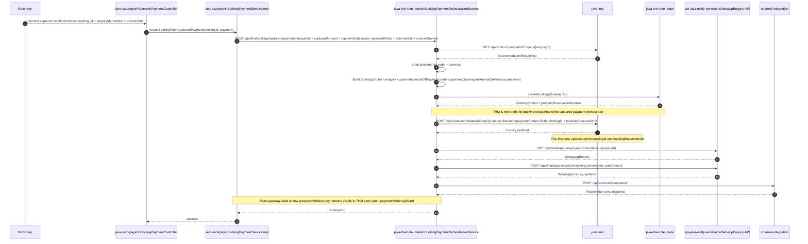
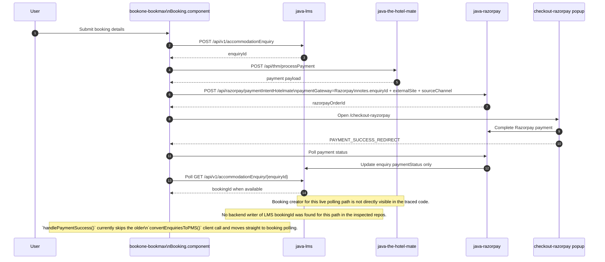
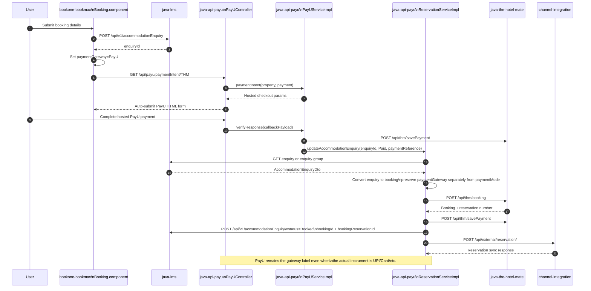
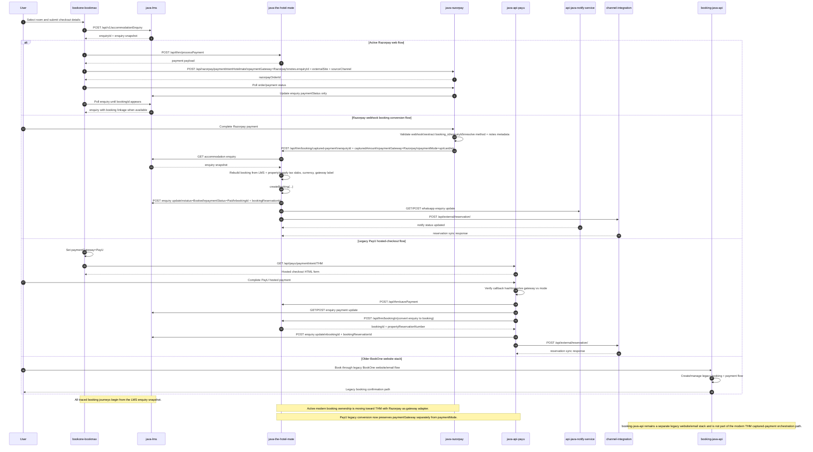

# Bookmax Checkout Flow

## Purpose

This document captures the Bookmax checkout and booking orchestration flow across the frontend and backend services in this workspace. It is intended to be the maintained reference for:

- which component creates the LMS enquiry
- which service creates the THM booking
- which service updates LMS after payment
- which downstream services are called after booking creation
- which repositories are required to understand and maintain the flow

## Related Repositories

The full checkout flow spans these repositories:

- `bookone-bookmax` - Angular frontend and payment orchestration UI
- `java-lms` - enquiry storage and enquiry status lookup
- `java-the-hotel-mate` - booking creation and captured-payment orchestration
- `java-razorpay` - Razorpay order creation and webhook validation/delegation
- `java-api-payu` - PayU hosted-checkout callbacks, payment verification, and enquiry-to-booking conversion
- `api-java-notify-service` - WhatsApp enquiry tracking and message workflows
- `channel-integration` - external reservation push to downstream PMS/channel manager
- `booking-java-api` - email and separate website booking stack used by older/alternate flows

## Service Ownership

### Frontend

Repository: `bookone-bookmax`

Primary responsibilities:

- create LMS accommodation enquiry
- request payment initiation
- send explicit payment gateway metadata from the checkout flow
- open payment window for Razorpay
- poll payment status in the current web flow
- poll LMS for booking completion in the current web flow

Important files:

- `src/app/views/landing/Booking/Booking.component.ts`
- `src/app/views/landing/checkout-razorpay/checkout-razorpay.component.ts`
- `src/app/views/landing/booking-confirmation/booking-confirmation.component.ts`
- `src/services/hotel-booking.service.ts`

### Enquiry Store

Repository: `java-lms`

Primary responsibility:

- store and return `AccommodationEnquiry`

Important endpoint:

- `POST /api/v1/accommodationEnquiry`
- `GET /api/v1/accommodationEnquiry/{enquiryId}`

### Booking Creator

Repository: `java-the-hotel-mate`

Primary responsibility:

- create the actual booking record in THM
- orchestrate captured-payment booking conversion for the webhook booking flow

Important endpoint:

- `POST /api/thm/booking`
- `POST /api/thm/booking/command`
- `POST /api/thm/booking/captured-payment`

Important note:

- `java-the-hotel-mate` is the actual booking creator
- the new captured-payment conversion path now lives in THM instead of `java-razorpay`

### Payment Orchestrator

Repository: `java-razorpay`

Primary responsibilities:

- create Razorpay order via `paymentIntentHotelmate`
- receive `payment.captured` webhook
- branch logic based on `notes.booking_id` versus `notes.enquiryId`
- delegate booking conversion to THM for the `notes.booking_id` path
- preserve source metadata in Razorpay order notes and forward exact gateway identity to THM

Important note:

- `notes.booking_id` path is now webhook validation plus THM delegation
- `notes.enquiryId` path only updates LMS payment status in the traced code

### PayU Payment Converter

Repository: `java-api-payu`

Primary responsibilities:

- render hosted-checkout form via `/api/payu/paymentIntent/{source}`
- verify PayU success and failure callbacks
- update THM payment records after PayU verification
- convert LMS enquiry into THM booking for the legacy PayU flow
- push external reservation after THM booking/payment save

Important endpoints:

- `GET /api/payu/paymentIntent/{source}`
- `POST /api/payu/successCallBack/{source}/{propertyId}`
- `GET /api/payu/checkPaymentStatus/{source}`
- `POST /api/payu/convert-to-pms`

Important note:

- the PayU backend is present in this workspace and now preserves `paymentGateway=PayU` separately from the payment instrument where available
- the repo targets Java 17, so local compile validation requires a Java 17 JDK

## Flow Summary

There are three important flows to distinguish.

### 1. Current Bookmax web Razorpay flow

This is the current in-page polling flow used by the newer `Booking.component.ts` experience.

High-level steps:

1. frontend creates LMS enquiry
2. frontend calls THM payment preparation endpoint
3. frontend sets `paymentGateway=Razorpay` and calls Razorpay payment intent endpoint with `notes.enquiryId`, `externalSite`, and `sourceChannel`
4. frontend opens Razorpay checkout popup
5. popup reports success back to parent window
6. frontend polls Razorpay payment status
7. `java-razorpay` updates LMS payment status for the enquiry
8. frontend polls LMS until booking information appears

Important implementation detail:

- in the traced code, the `notes.enquiryId` path in `java-razorpay` updates enquiry payment status only
- no backend writer of LMS `bookingId` was found for this path in the inspected repositories
- `handlePaymentSuccess()` currently jumps straight to booking polling and the older `convertEnquiriesToPMS()` call remains commented out in `Booking.component.ts`

### 2. Razorpay `booking_id` webhook flow

This flow is used when Razorpay webhook payload contains `notes.booking_id`. In practice this value is treated as the LMS enquiry id.

High-level steps:

1. Razorpay sends `payment.captured`
2. `RazorpayPaymentController` detects `notes.booking_id`
3. `BookingPaymentServiceImpl.createBookingFromCapturedPayment(...)` is called
4. `java-razorpay` delegates to THM `/api/thm/booking/captured-payment`
5. THM fetches enquiry from LMS
6. THM fetches property details for tax slabs and currency
7. THM builds `BookingDto`
8. THM creates booking and returns booking details
9. THM updates LMS enquiry
10. THM updates WhatsApp enquiry tracking
11. THM pushes external reservation downstream

Important implementation detail:

- this flow updates LMS `bookingReservationId`
- THM now also sets LMS `bookingId` after booking creation
- tax is derived from THM property tax slabs rather than hard-coded GST thresholds
- currency is derived from property `localCurrency` rather than a hard-coded `INR` fallback
- gateway identity is now carried separately from payment method: THM prefers `paymentGateway` for stored/displayed payment label, while `paymentMode` can carry the actual instrument such as `upi`
- Razorpay now forwards `paymentGateway=Razorpay`, `paymentMode=<razorpay method>`, `externalSite`, and `sourceChannel` to THM

### 3. Legacy Bookmax web PayU flow

This is the older hosted-checkout flow that still routes through `java-api-payu`.

High-level steps:

1. frontend creates LMS enquiry
2. frontend stamps `paymentGateway=PayU`
3. frontend opens PayU hosted checkout via `/api/payu/paymentIntent/THM`
4. PayU posts success callback into `java-api-payu`
5. `java-api-payu` verifies callback hash and updates THM payment
6. for THM source, `java-api-payu` updates LMS enquiry payment status and payment reference
7. `java-api-payu` converts LMS enquiry into THM booking
8. `java-api-payu` updates LMS with `bookingId` and `bookingReservationId`
9. `java-api-payu` pushes external reservation downstream

Important implementation detail:

- PayU now preserves gateway identity separately from payment mode in its own backend flow
- `ReservationServiceImpl` uses `paymentGateway` preferentially when creating THM booking labels and external reservation payment labels
- `createPaymentForCRMEnquiryToConfirmed(...)` now uses booking/enquiry currency instead of hard-coded `INR`

## Sequence Diagram: Razorpay `booking_id` Webhook Flow



## Sequence Diagram: Current Bookmax Web Razorpay Flow



## Sequence Diagram: Legacy Bookmax Web PayU Flow



## Final Cross-Repo Sequence Diagram

This is the consolidated cross-repo reference diagram. It shows the shared enquiry origin, the active Razorpay and PayU branches, the downstream booking side effects, and where `booking-java-api` still sits as an alternate legacy website stack.

### Presentation Version

This version is intentionally simplified for walkthroughs with product, operations, or stakeholders.

```mermaid
sequenceDiagram
    autonumber
    participant U as User
    participant FE as bookone-bookmax
    participant LMS as java-lms
    participant RP as java-razorpay
    participant PAYU as java-api-payu
    participant THM as java-the-hotel-mate
    participant WA as api-java-notify-service
    participant CI as channel-integration
    participant BJA as booking-java-api

    U->>FE: Start checkout
    FE->>LMS: Create accommodation enquiry
    LMS-->>FE: enquiryId + enquiry snapshot

    alt Modern Razorpay web journey
        FE->>RP: Start Razorpay payment
        RP-->>FE: order details
        FE->>RP: Check payment status
        RP->>LMS: Mark enquiry payment as paid
        FE->>LMS: Poll for booking readiness
    else Razorpay webhook booking journey
        U->>RP: Complete payment
        RP->>THM: Send captured-payment booking request
        THM->>LMS: Read enquiry snapshot
        THM->>THM: Create booking from enquiry + property data
        THM->>LMS: Update enquiry with booking linkage
        THM->>WA: Update WhatsApp enquiry state
        THM->>CI: Push external reservation
    else Legacy PayU journey
        FE->>PAYU: Start PayU hosted checkout
        U->>PAYU: Complete payment
        PAYU->>THM: Save payment / create booking
        PAYU->>LMS: Update enquiry and booking linkage
        PAYU->>CI: Push external reservation
    else Older legacy website stack
        U->>BJA: Book through old BookOne website flow
        BJA->>BJA: Handle legacy booking/payment flow
    end

    Note over FE,LMS: LMS is the common enquiry origin across the traced flows.
    Note over RP,THM: Razorpay is the modern gateway adapter; THM owns modern booking orchestration.
    Note over PAYU,THM: PayU still supports a legacy hosted-checkout conversion path.
    Note over BJA: booking-java-api remains a separate older booking stack.
```

### Engineering Version



## Legacy PayU Status

The older PayU path is now updated in both the frontend and the PayU backend in this workspace.

What is updated here:

- `Booking.component.ts` now stamps `paymentGateway=PayU` before the legacy PayU flow continues
- the legacy `convertEnquiriesToPMS()` payload now includes both `paymentGateway` and `paymentMode`
- `java-api-payu` now accepts `paymentGateway` on the enquiry payload
- `java-api-payu` now preserves `paymentGateway=PayU` separately from the actual payment mode when saving THM payment and external reservation data
- `java-api-payu` now uses enquiry/booking currency instead of hard-coded `INR` during THM payment save

What is still pending:

- full compile validation of `java-api-payu` requires Maven to run with Java 17 in the local environment

Important note:

- in the current `Booking.component.ts`, `handlePaymentSuccess()` calls `handlePmsSuccess()` directly and leaves `convertEnquiriesToPMS()` commented out, so the legacy payload enhancement is prepared but not part of the active success path shown in the current UI flow

## Older Direct Booking Flow Still Present in Frontend

Older frontend components still contain a direct-booking pattern where the frontend itself calls THM booking creation and then posts booking linkage back to LMS.

Important files:

- `src/app/views/landing/Confirm-Booking/Confirm-Booking.component.ts`
- `src/app/views/landing/booking-complete/booking-complete.component.ts`

In that older flow:

1. frontend calls `POST /api/thm/booking`
2. THM returns booking id and reservation number
3. frontend posts enquiry update to LMS with `bookingId` and `bookingReservationId`
4. frontend pushes external reservation

This is different from the newer polling-based flow and should not be mixed into the current web Razorpay sequence unless you are documenting the older path explicitly.

## Key Findings

- `java-the-hotel-mate` is the actual THM booking creator
- `java-the-hotel-mate` is now the booking orchestrator for the `notes.booking_id` captured-payment path
- `java-razorpay` is now the payment gateway adapter for that webhook path
- exact gateway identity is now preserved separately from the payment instrument in the Razorpay to THM contract
- `java-api-payu` now applies the same gateway-versus-mode separation for the legacy PayU conversion path
- `java-razorpay` `EnquiryPaymentServiceImpl` only updates payment status for the `notes.enquiryId` path in the traced code
- older frontend paths explicitly write LMS `bookingId` and `bookingReservationId`
- the current web Razorpay polling path expects LMS booking information to appear later, but the backend writer of LMS `bookingId` was not found in the inspected repositories
- local compile verification of `java-api-payu` is currently blocked by the active shell using a JDK lower than 17

## Maintenance Notes

Update this document whenever any of the following changes:

- `Booking.component.ts` payment flow logic
- `checkout-razorpay.component.ts` success handling
- `RazorpayPaymentController` webhook branching
- `BookingPaymentServiceImpl` delegation logic
- `PayUController` callback and convert-to-pms logic
- `ReservationServiceImpl` enquiry-to-booking conversion logic
- THM captured-payment orchestration logic
- `EnquiryPaymentServiceImpl` payment-status-only logic
- THM `/api/thm/booking` ownership or response shape
- LMS enquiry fields used for booking linkage

When updating the diagrams, preserve the distinction between:

- `booking_id` webhook orchestration flow
- `enquiryId` payment-status flow
- older direct-booking frontend flow