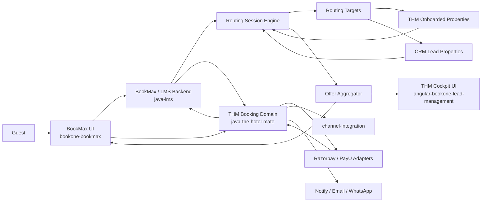
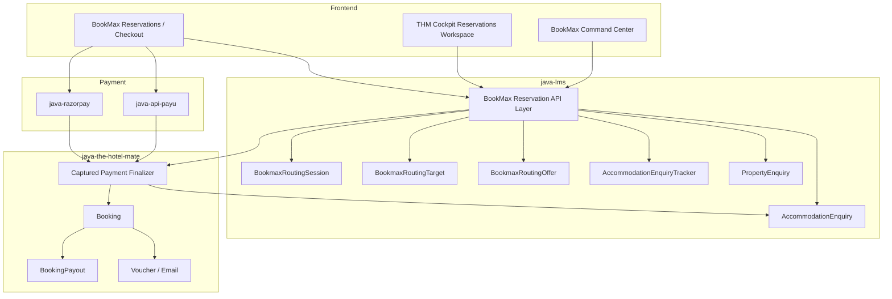

# BookMax Final Requirements And Architecture

Last updated: 2026-04-22

## Purpose

This document is the consolidated reference for the BookMax and THM Cockpit program across:

- enquiry intake
- demand routing and redistribution
- enquiry-to-booking conversion
- payment and booking finalization
- checkout, payout, and ops visibility

It is intended to replace fragmented design reading with one maintained view of:

- requirements
- ownership boundaries
- architecture
- core components
- key entities
- current implementation state

## Source Documents Reviewed

### Core architecture sources

- `BOOKMAX_CHECKOUT_FLOW.md`
- `BOOKMAX_DEMAND_REDISTRIBUTION_ENGINE.md`
- `BOOKMAX_REFACTOR_IMPLEMENTATION_PLAN.md`
- `BOOKONE_CROSS_PROJECT_FIELD_MAPPING.md`
- `BOOKONE_OPS_SPEC.md`
- `FLOW_MARKETING_TO_OPS.md`
- `IMPLEMENTATION_TRACKER.md`

### Supporting documents reviewed

- `BOOKMAX_ANALYTICS_IMPLEMENTATION_PLAN.md`
- `BOOKONE_REPLIT_DESIGN_SYSTEM_MAPPING.md`
- `DESIGN_GAP_TRACKER.md`
- `DESIGN_GAP_PAGE1_BUSINESS_LEADS.md`
- `DESIGN_POLISH_PHASE_1_2_4.md`
- `BUSINESS_LEAD_PRODUCT_CODE_MIGRATION_PLAN.md`
- `migration_notes.md`
- `sql/bookmax_prod_extract/README.md`
- repo `README.md` files in `bookone-bookmax`, `angular-bookone-lead-management`, and `java-lms`

### Documents not treated as architecture drivers

- `SPIN_WHEEL_IMPLEMENTATION_PLAN.md`
  This is feature-specific and not part of the BookMax/THM operating architecture.

## Executive Summary

BookMax is the enquiry and demand-orchestration layer.

THM Cockpit is the operational control surface.

THM booking domain remains the authoritative owner of:

- confirmed booking creation
- payment-backed booking finalization
- voucher and booking email generation
- checkout and payout lifecycle

The target operating model is:

1. guest creates enquiry in BookMax
2. LMS stores the durable enquiry record
3. BookMax routes first to the intended THM-ready property
4. if response is missing or unusable, BookMax redistributes to:
   - nearby onboarded properties
   - then nearby CRM lead properties
5. BookMax collects responses and normalizes them into offers
6. guest or operator selects one offer
7. THM creates the booking and updates LMS with booking linkage
8. THM continues payment, voucher, checkout, and payout workflows

## Business Goals

### Guest goals

- submit one enquiry without restarting if the first hotel does not respond
- receive comparable alternative offers quickly
- stay inside a single guided communication flow
- complete payment and booking confirmation reliably

### Hotel goals

- receive relevant enquiries quickly
- respond through simple channels such as email or WhatsApp
- compete for nearby demand when the original property does not respond
- receive confirmed bookings with less manual coordination

### Operations goals

- see one live thread for each enquiry
- know who the enquiry was forwarded to
- track SLA, response status, and escalation state
- intervene manually when automation is not enough
- convert accepted offers into THM bookings cleanly

## Scope

### In scope

- BookMax enquiry intake
- pay-now and pay-later enquiry flows
- routing and redistribution engine
- routing-session and routing-target persistence
- offer normalization and selection
- THM Cockpit operational visibility
- THM booking handoff after offer acceptance
- checkout and payout operations

### Out of scope

- replacing THM booking creation
- replacing THM payout or reconciliation ownership
- turning CRM lead properties into live inventory providers
- moving hotel service ingestion into `channel-integration`

## High-Level Requirements

## 1. Enquiry Intake

The system must:

- accept guest enquiry or booking intent from BookMax UI
- create a durable LMS enquiry record before payment-backed booking finalization
- preserve guest, stay, property, and source context
- support both pay-now and pay-later styles

Primary source of truth:

- `java-lms` `AccommodationEnquiry`

## 2. Demand Routing And Redistribution

The system must:

- create a routing session for an enquiry
- notify the primary property first
- measure response against SLA
- escalate automatically or manually when no usable response is received
- maintain a record of all forwarded targets and responses

Routing order:

1. primary THM onboarded property
2. nearby THM onboarded properties
3. nearby CRM lead properties

## 3. Offer Aggregation

The system must:

- collect property responses from different supply types
- normalize them into one comparable offer model
- surface offers in the Cockpit drawer and command center
- allow one offer to be selected and the others to be closed or rejected

## 4. Booking Conversion

The system must:

- create the booking in THM after offer acceptance or successful payment-backed finalization
- update LMS enquiry with:
  - `bookingId`
  - `bookingReservationId`
- keep the frontend dependent on backend-created booking linkage rather than browser-created booking records

## 5. Payment Finalization

The system must:

- keep payment gateway adapters limited to payment responsibilities
- route normalized captured-payment events into THM
- keep `paymentGateway` separate from `paymentMode`
- reconstruct selected services and quoted totals from LMS snapshot fields where needed

## 6. Checkout And Payout

The system must:

- show today check-in and checkout operational queues
- support bank-file generation for payout operations
- track payout state per booking through `BookingPayout`
- keep payout and reconciliation ownership in THM

## 7. Cockpit Visibility And Intervention

The system must provide operators with:

- queue-level visibility
- enquiry drawer with routing details
- timeline of forwarding and responses
- manual send / resend / reroute controls
- offer desk
- owner, notes, status, and property outreach tools

## Supply Model

## THM onboarded property

Definition:

- an operationally activated property inside the THM ecosystem

Characteristics:

- property profile and geolocation exist
- trusted response channels exist
- booking conversion confidence is high
- suitable for primary and L1 routing

## CRM lead property

Definition:

- a commercially known property in CRM but not a fully operational THM supply node

Characteristics:

- profile and contact details exist
- no dependable live inventory/rate contract
- manual quote mode only
- suitable only for fallback or rescue routing

## End-To-End Flow

### Flow A: Pay-later or enquiry-first demand routing

1. guest creates enquiry in BookMax
2. LMS creates `AccommodationEnquiry`
3. BookMax starts `RoutingSession`
4. primary property receives the first routing target
5. SLA waits for response
6. if no usable response:
   - escalate to nearby onboarded properties
7. if still unresolved:
   - escalate to nearby CRM lead properties
8. responses are collected
9. BookMax normalizes responses into offers
10. one offer is selected
11. THM booking creation is triggered
12. LMS stores booking linkage
13. THM continues payment, voucher, checkout, and payout flow

### Flow B: Pay-now booking finalization

1. frontend creates LMS enquiry
2. frontend starts gateway checkout
3. payment adapter validates callback or webhook
4. adapter delegates normalized payment facts to THM
5. THM finalizes booking creation
6. THM updates LMS `bookingId` and `bookingReservationId`
7. frontend polls LMS until booking linkage is available
8. frontend renders booking confirmation from backend-created booking data

## Architecture Principles

- BookMax owns routing logic and routing state
- THM Cockpit owns visibility and intervention, not duplicate orchestration
- THM owns booking-domain truth
- LMS owns durable enquiry and booking-linkage persistence
- payment adapters must not own booking orchestration
- downstream room-booking transport and hotel service sync must remain separate concerns

## System Ownership By Repository

| Repository | Responsibility |
| --- | --- |
| `bookone-bookmax` | Guest-facing BookMax frontend and checkout/orchestration UI |
| `angular-bookone-lead-management` | THM Cockpit / CRM / Ops admin frontend |
| `java-lms` | Enquiry persistence, BookMax routing engine, Cockpit read/write APIs |
| `java-the-hotel-mate` | Booking creation, captured-payment finalization, checkout, payout |
| `java-razorpay` | Razorpay order creation and webhook validation, THM delegation |
| `java-api-payu` | PayU hosted flow and callback validation, THM delegation |
| `channel-integration` | Room-booking-compatible downstream reservation transport only |
| `api-java-notify-service` | WhatsApp tracking and communication support |

## Logical Component Architecture

## Component Diagram

## Core Entities

## Existing durable entities

### AccommodationEnquiry

Purpose:

- durable enquiry record
- booking linkage store
- guest/stay context
- pre-booking service quote snapshot

Key fields:

- `enquiryId`
- `bookingId`
- `bookingReservationId`
- `couponCode`
- `promotionName`
- `serviceQuoteSummary`
- guest, stay, and requested-property fields

### Booking

Purpose:

- authoritative booking domain record in THM

### BookingPayout

Purpose:

- payout lifecycle state for booking settlements

## New BookMax routing entities

### BookmaxRoutingSession

Purpose:

- one routing run for one enquiry

Business meaning:

- `enquiryId` is the case
- `routingSessionId` is the routing round for that case

Key fields:

- `id`
- `enquiryId`
- `primaryPropertyId`
- `routingStatus`
- `escalationLevel`
- `slaStartedAt`
- `slaDueAt`
- `sessionReference`

### BookmaxRoutingTarget

Purpose:

- one forwarded target per property per routing session

Key fields:

- `id`
- `routingSessionId`
- `propertyId`
- `propertyName`
- `sourceType`
- `level`
- `channel`
- `responseStatus`
- `quotedAmount`
- `sentAt`
- `respondedAt`

### BookmaxRoutingOffer

Purpose:

- normalized guest-facing offer within a routing session

Key fields:

- `id`
- `routingSessionId`
- `routingTargetId`
- `propertyId`
- `propertyName`
- `sourceType`
- `roomType`
- `totalAmount`
- `cancellationPolicy`
- `confidenceLevel`
- `offerStatus`
- `validUntil`

Implementation note:

- `offer.id` is database-generated through JPA `GenerationType.IDENTITY`
- it is created when the row is inserted into `bookmax_routing_offer`

## State Model

### Routing session states

- `NEW`
- `SENT_TO_PRIMARY`
- `PRIMARY_RESPONDED`
- `ESCALATED_L1`
- `ESCALATED_L2`
- `OFFERS_READY`
- `OFFER_ACCEPTED`
- `PAYMENT_PENDING`
- `BOOKED`
- `EXPIRED`
- `CLOSED`

### Routing target states

- `PENDING`
- `SENT`
- `VIEWED`
- `RESPONDED_AVAILABLE`
- `RESPONDED_UNAVAILABLE`
- `RESPONDED_ALT`
- `TIMED_OUT`
- `DECLINED`

### Offer states

- `OPEN`
- `SELECTED`
- `EXPIRED`
- `REJECTED`

## API Surface Summary

### Existing BookMax/Cockpit reservation APIs

- `GET /api/v1/bookmax/reservations/summary`
- `GET /api/v1/bookmax/reservations/overview`
- `GET /api/v1/bookmax/reservations/{enquiryId}`
- `GET /api/v1/bookmax/reservations/{enquiryId}/timeline`
- `PATCH /api/v1/bookmax/reservations/{enquiryId}/owner`
- `PATCH /api/v1/bookmax/reservations/{enquiryId}/notes`
- `PATCH /api/v1/bookmax/reservations/{enquiryId}/status`
- `GET /api/v1/bookmax/reservations/{enquiryId}/property-outreach`
- `POST /api/v1/bookmax/reservations/{enquiryId}/property-outreach`

### Routing APIs now added in LMS

- `POST /api/v1/bookmax/reservations/{enquiryId}/routing/start`
- `GET /api/v1/bookmax/reservations/{enquiryId}/routing`
- `GET /api/v1/bookmax/reservations/{enquiryId}/routing/targets`
- `POST /api/v1/bookmax/reservations/{enquiryId}/routing/targets`
- `PATCH /api/v1/bookmax/reservations/{enquiryId}/routing/targets/{targetId}/response`
- `GET /api/v1/bookmax/reservations/{enquiryId}/routing/offers`
- `POST /api/v1/bookmax/reservations/{enquiryId}/routing/offers`
- `PATCH /api/v1/bookmax/reservations/{enquiryId}/routing/offers/{offerId}/select`

### THM booking and payout APIs

- `POST /api/thm/booking`
- `POST /api/thm/booking/command`
- `POST /api/thm/booking/captured-payment`
- BookMax checkout / payout routes in THM for today checkouts and bank file generation

## SLA And Routing Algorithm Requirements

## Already implemented

- routing session persistence
- routing target persistence
- offer persistence
- manual routing start from Cockpit
- manual add-target workflow
- manual target-response update
- manual offer selection

## Not yet implemented

- nearby property discovery algorithm
- ranking by distance, score, or response reliability
- business-hours-aware SLA worker
- automatic escalation from primary to L1 to L2
- auto-stop rules once enough usable offers exist

This means the current system has the routing framework, but not the full routing algorithm yet.

## Cockpit UX Requirements

The reservations workspace should be the main operational surface.

### List-level requirements

Each enquiry row should show:

- routing stage
- targets sent
- response summary
- SLA label
- best-offer label when available

### Drawer requirements

The enquiry drawer should show:

- enquiry summary
- routing session summary
- routing timeline
- forwarded targets table
- offer desk
- ownership and notes
- property outreach
- alternative property suggestions

### Current UX status

Implemented:

- live routing session in drawer
- live routing targets in drawer
- live offers in drawer
- select offer action wired to LMS
- owner, notes, status, property outreach already wired

Pending:

- accept-offer to THM booking handoff
- real command-center routing metrics
- automatic routing and SLA visual states driven by background automation

## Delivery Status Snapshot

### Completed or materially delivered

- hardened checkout architecture with THM as booking finalizer
- LMS-backed reservations summary, overview, detail, and timeline
- modern Cockpit reservations workspace
- checkout / payout flow with `BookingPayout`
- routing session + target + offer persistence in LMS
- live Angular drawer wiring for routing session, targets, and offers

### Partially delivered

- command-center uses reservation overview, not routing-session metrics yet
- routing states exist, but auto-escalation logic does not
- offer desk is live, but booking handoff after selection is still pending

### Pending

- real routing algorithm
- automated SLA engine
- offer acceptance to THM booking creation flow inside the new routing path
- routing analytics and optimization
- bank reconciliation upload and UTR workflow for payouts

## Recommended Next Implementation Order

1. complete offer acceptance to THM booking handoff
2. add routing-session-based command-center metrics
3. implement candidate discovery and ranking
4. implement business-hours-aware SLA escalation worker
5. add stop rules, retry rules, and closure rules
6. add routing analytics and operational reporting

## Decision Summary

- Use LMS as the durable enquiry and routing-state store.
- Use BookMax as the orchestration engine.
- Use THM Cockpit as the execution and supervision interface.
- Use THM as the booking, payment-finalization, checkout, and payout owner.
- Keep CRM lead properties as fallback/manual supply, not primary structured supply.
- Keep payment adapters thin and booking-domain-agnostic.

